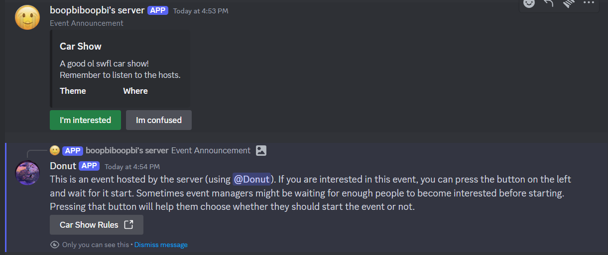

# Introduction to templates

You can create template for all the different types of sessions that your server hosts.\
For example: `Car Show`, `Slot Meet`, `Greenville RP Startup`, `ERLC SSU`, `Border RP`, or whatever you want. \
A template defines some key features about the event, such the channel the announcement should be posted to, and a general description of the event. Donut uses webhooks to send the announcement message, so that means you can also define the username and avatar of the webhook.

You can also specify a custom `Info` section. In it you should include more information about your event, and answer questions that you might be anticipating from members. The info message when a user presses the button on the event announcement message. You can also specify custom URL buttons that will be sent with the info message. 
As you can in the image, the announcement message has a help button called, customized to say "Im confused". It sent a custom message with a URL button that was specified when making the template.

Similarly, there is a `parameters` section for you to fill. Each parameter represents a question that hosts will have to answer when the event starts. These are helpful for clarifying the exact nature of the event being started. For example, if you are a car shows server, you would create a parameter that says `What is the theme?`, and the host would reply with something like `German cars from the 2000s`. The parameter's title, and host's answer will be passed as is into the announcement embed, and will not alter anything about how Donut operates.

> [!IMPORTANT]
> Since templates are heavily user-generated, they must be approved before use. \
> Approval will take a short time, as long as everything inside it follows the [Discord ToS](https://discord.com/archive) and Donut Guidelines.

## How to create a template

Run the command `/events template new`. \
This will send a link. Fill out the form on the link and once your template has been reviewed, it will be available in your server.

> [!TIP]
> The link requires you to sign in using your Discord account. \
> If you sign into a different Discord account than the one used to run the command, you may receive an error.

## The different parts of a template.

This table lists the questions that are in the template form, and what they mean.

| Field | Required | What is this |
| --- | --- | --- |
| Title                    | Yes | The title of your event. 
| Description              | Yes | A brief description your event is about. 
| Thumbnail image URL      | No  | The URL of the image to show in the embed announcement.
| Announcement channel ID  | Yes | Where to announce this event.
| Logs channel ID          | Yes | Where to post logs related to this event.
| Roblox Verifications     | Yes | Whether or not to verify and log the Roblox accounts of users joining. Can be disabled in case your event is not related to Roblox.
| Info Label               | No  | The title of the `Information` button attached to the announcement embed **(defaults to `Information`)**.
| Info Text                | No (Recommended)  | A more detailed description of what your event is about. 
| FAQ Buttons              | No  | Relevant links to show when a user presses the FAQ button.
| Webhook name             | No  | Custom username to use when sending announcement message **(defaults to server name)**.
| Webhooks avatar URL      | No  | Custom avatar to use when sending announcement message **(default to server name)**.
| Event parameters         | No (Recommended) | Custom fields to provide context about the event being started from the template.

## What happens after I submit the template?

It will be reviewed. If your template doesn't break Discord ToS, and we deem it is suitable for Donut, it will be approved shortly. \
This step is compulsory and not negotiable. 

### Template rules:

Make sure your template AND events don't:
- Include profanity
- Include mature themes (sexually explicit and sexually suggestive content), or make it available to users.
- Include hate speech
- Attempt to organize, promote, or support harassment or violence
- Break any part of the Discord ToS

Failure to adhere will result in the app being removed from your server and the server owner being blacklisted from using Donut again. \
Donut keeps discretion on whether or not your server violates any of the above. \
In addition, we may also remove or suspend Donut from your server if we deem it's use has not been healthy
